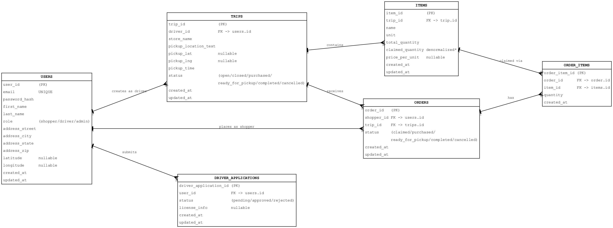

# Bulk Buddy -- The Collaborative Grocery Platform

CS162 Final Project | Minerva University

Bulk Buddy connects cost-conscious San Francisco residents with drivers heading to warehouse stores, enabling coordinated bulk purchases. Shoppers claim item portions from upcoming trips, prepay their share, and pick up their goods -- unlocking bulk savings without needing a car or extra storage space.

## Quick Start

See [docs/running-locally.md](docs/running-locally.md) for the full setup guide.

### Docker (recommended)

```bash
cp backend/.env.example .env          # create root .env
# edit .env and set SECRET_KEY and ADMIN_TOKEN
docker compose up --build
```

- Frontend: http://localhost:3000
- Backend API: http://localhost:5001

### Local (without Docker)

**Prerequisites:** Python 3.12+, Node.js 18+

```bash
cp backend/.env.example backend/.env  # create backend .env
bash scripts/dev.sh                   # starts both backend and frontend
```

Frontend: http://localhost:3000 -- Backend: http://127.0.0.1:5001

<details>
<summary>Manual setup (if you prefer separate terminals)</summary>

Terminal 1 -- backend:

```bash
cd backend
python3 -m venv .venv
source .venv/bin/activate             # Windows: .venv\Scripts\activate
pip install -r requirements.txt
flask run --port 5001
```

Terminal 2 -- frontend:

```bash
cd frontend
npm install
npm start
```

</details>

## Database Schema



> `claimed_quantity` on `items` is a denormalized counter kept in sync with `SUM(order_items.quantity)`, updated atomically on every order create/cancel.

## Repository Structure

```
CS162-Bulk-Buddy/
├── .github/
│   ├── PULL_REQUEST_TEMPLATE.md   # PR template (used automatically)
│   └── workflows/
│       └── test.yml               # CI: lint + backend tests + frontend tests
│
├── docs/
│   ├── ARCHITECTURE.md            # System architecture and API reference
│   ├── CONTRIBUTING.md            # Branching strategy and PR rules
│   ├── DATABASE.md                # Schema details and design decisions
│   ├── running-locally.md         # Full local and Docker setup guide
│   ├── prd.md                     # Product requirements document
│   ├── roadmap.md                 # MVP progression and deferred features
│   ├── UX_WIREFRAMES.md           # UX wireframes reference
│   ├── er_diagram.png             # Entity relationship diagram image
│   └── design/                    # Figma exports and logo assets
│
├── frontend/                      # React 19 frontend application
│   ├── src/
│   │   ├── pages/                 # One directory per page
│   │   ├── components/            # Shared UI components
│   │   ├── contexts/              # SessionProvider, CartProvider, ApiProvider
│   │   ├── hooks/                 # Data fetching and form state hooks
│   │   └── utils/                 # Formatting, adapters, cart helpers
│   ├── tests/                     # Jest tests
│   └── README.md
│
├── backend/                       # Python (Flask) backend API
│   ├── app/
│   │   ├── models/                # SQLAlchemy ORM models (6 tables)
│   │   ├── routes/                # Flask blueprints (auth, admin, trip, me, driver)
│   │   └── services/              # Business logic layer
│   ├── tests/                     # pytest test suite (85% coverage enforced)
│   ├── requirements.txt
│   └── README.md
│
├── docker-compose.yml             # Docker Compose for local development
├── .env.example -> backend/.env.example
│
└── scripts/
    ├── dev.sh                     # Start backend + frontend without Docker
    ├── lint.sh                    # Run flake8 + Black
    └── test.sh                    # Run all tests
```

## Workflow Rules

- **Never push directly to `main`** -- always use a feature branch + PR.
- **Every PR must be reviewed** by at least one teammate before merging.
- **Use the PR template** -- it fills in automatically when you create a PR.
- See [docs/CONTRIBUTING.md](docs/CONTRIBUTING.md) for full details.

## Tech Stack

| Layer | Technology |
|-------|------------|
| Frontend | React 19 |
| Backend | Python 3.12, Flask 3.1 |
| ORM | SQLAlchemy 2.0 |
| Auth | Flask-Login (session-based) |
| Database | SQLite |
| Testing | pytest + pytest-cov (backend), Jest (frontend) |
| CI/CD | GitHub Actions |
| Deployment | Docker Compose |

## Team

- Bo Shih -- PM / Design
- Ekene -- Backend / Deployment
- Jonathan -- Frontend
- Tara -- PM / Design
- Temilola -- Backend / DB

## License

MIT
