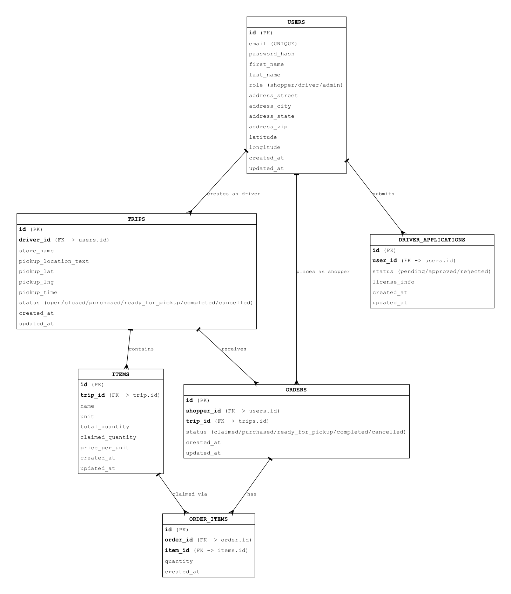
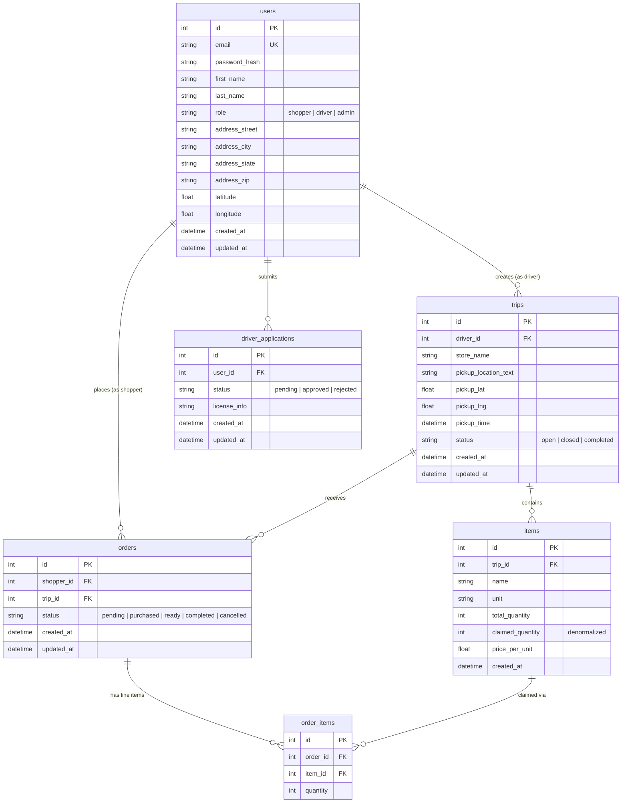

# Database Schema

## Overview

Bulk Buddy uses SQLite with SQLAlchemy ORM. The schema consists of 6 tables
in third normal form (3NF). One intentional denormalization exists:
`items.claimed_quantity` is stored directly rather than computed from
`SUM(order_items.quantity)` to avoid a join + aggregate on every trip card
render and availability check. It is updated atomically in the same
transaction as order creation.

## ER Diagram

Mermaid source (for GitHub rendering)

## Table Descriptions

### users

Every person on the platform. The `role` field controls permissions:

- **shopper** (default): can browse trips, claim items, place orders.
- **driver**: can create trips and manage items. Requires an approved DriverApplication.
- **admin**: can review driver applications and manage the platform.

The address and coordinates are stored at registration. Coordinates are geocoded
once at signup to avoid repeated API calls when computing distances.

### trips

A driver's planned run to a warehouse store. Has its own pickup coordinates
(not derived from the driver's home address) so the driver can choose a custom
pickup location per trip.

**Statuses**: `open` (accepting claims), `closed` (no longer accepting), `completed` (done).

### items

Products the driver plans to buy, with available quantities. Belongs to exactly one trip.

`claimed_quantity` is a denormalized counter that tracks how many units have been claimed
across all orders. Updated atomically in the checkout transaction. The invariant
`claimed_quantity <= total_quantity` is enforced at the application layer.

### orders

Links a shopper to a specific trip. One order per shopper per trip. If the inventory
aggregation view splits a cart across multiple drivers, it creates one order per trip.

**Status transitions**: `pending` -> `purchased` -> `ready` -> `completed`.
An order can also be `cancelled` at any point before `completed`.

### order_items

Line items within an order. Each row records how many units of a specific item the
shopper claimed. This is the join table between orders and items.

### driver_applications

Tracks the shopper-to-driver upgrade process. Stored separately from users because
a user can apply multiple times (rejection followed by reapplication), and it keeps
driver-specific fields out of the users table.

## Indexing Strategy

Indexes are placed on columns used in WHERE, JOIN, and ORDER BY for the
application's most frequent queries.

| Index | Table | Columns | Serves |
|---|---|---|---|
| `email` (unique) | users | email | Login lookup |
| `ix_trips_driver_id` | trips | driver_id | "My trips" page |
| `ix_trips_status` | trips | status | Open trip filtering |
| `ix_trips_status_coords` | trips | status, pickup_lat, pickup_lng | Nearby open trips |
| `ix_items_trip_id` | items | trip_id | Items for a trip |
| `ix_orders_shopper_id` | orders | shopper_id | "My orders" page |
| `ix_orders_trip_id` | orders | trip_id | Driver's incoming orders |
| `ix_order_items_order_id` | order_items | order_id | Line items in an order |
| `ix_order_items_item_id` | order_items | item_id | Claims against an item |
| `ix_driver_applications_user_id` | driver_applications | user_id | Application status lookup |

## Key Query Patterns

**Trip feed (shopper home page)**:
Query open trips, compute distance from shopper's coordinates to each trip's
pickup coordinates, sort by distance. Uses `ix_trips_status_coords`.

**Trip detail**:
Fetch items for a trip by `trip_id`. Uses `ix_items_trip_id`.

**Inventory aggregation view**:
Join items with trips where `trips.status = 'open'` and
`items.claimed_quantity < items.total_quantity`. Group by item name for
the aggregate view.

**Checkout (order creation)**:
Inside a single transaction: create an Order, create OrderItems for each
claimed item, and increment each item's `claimed_quantity`. If any item
would exceed `total_quantity`, the transaction rolls back.

**My orders / My trips**:
Simple lookups by `shopper_id` or `driver_id` with their respective indexes.
